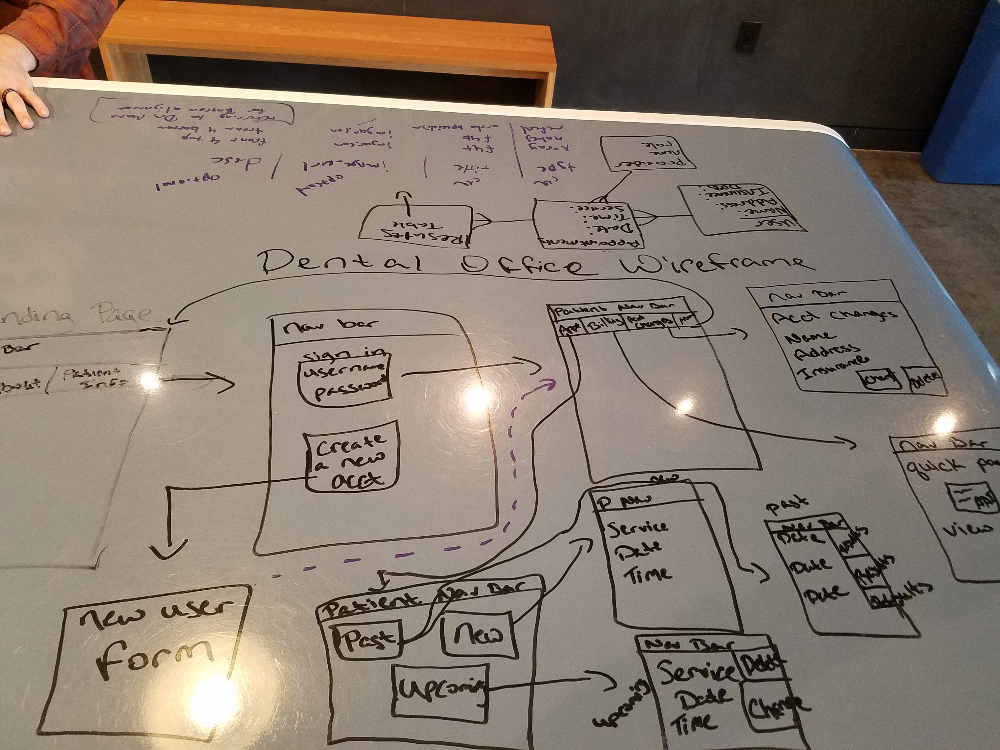

# Final-Project
# Dental Office

<h2> Overview </h2>
The Dental Office app is designed as a means of reaching new and current customers. Patients are able to view appointments online and schedule new appointments.  

<h2>Project Links</h2>
https://trello.com/b/Al2jcgwH/dental-office

<h2>https://gq-dental-office.herokuapp.com/<h2>

<h2>Technical Specifications</h2>
This application has 3 models. 
Utilizing:
<ul>
Ruby</ul>
<ul>Rails</ul>
<ul>Semantic UI</ul>
<ul>Unsplash</ul>
<ul>Calendly</ul>
<ul>Mongoose DB
</ul>

<h2>Wireframe</h2>

<h2>ERD</h2>

<h2>Next Release</h2>
<ul>Design</ul>
<ul>More general information about the company.</ul>
<ul>Calendly saves to the database.</ul>
